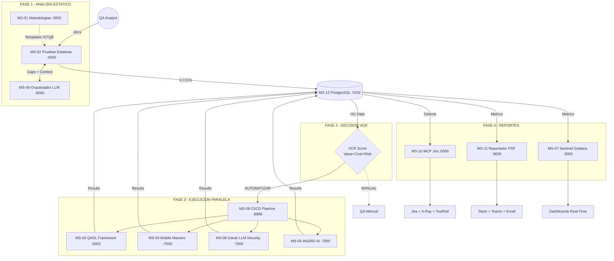
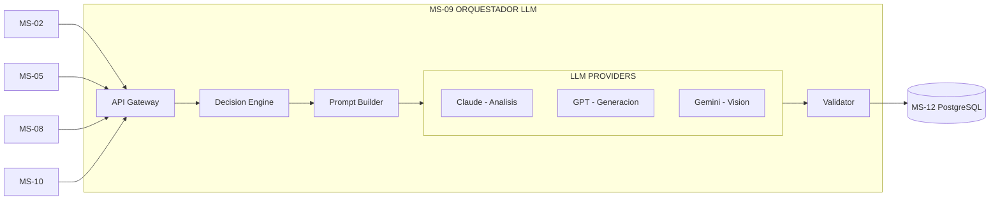
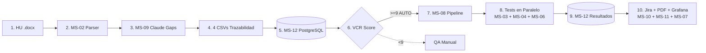

# QASL NEXUS LLM - Arquitectura

---

## Arquitectura de 12 Microservicios

```mermaid
flowchart TD
    USER(("QA Analyst"))

    USER -->|".docx"| MS02

    subgraph PHASE1["FASE 1 - ANALISIS ESTATICO"]
        MS01["MS-01 Metodologias :3000"]
        MS02["MS-02 Pruebas Estaticas :4000"]
        MS09A["MS-09 Orquestador LLM :8000"]
    end

    MS01 -.->|"Templates ISTQB"| MS02
    MS02 <-->|"Gaps + Context"| MS09A
    MS02 -->|"4 CSVs"| DB

    subgraph PHASE2["FASE 2 - DECISION VCR"]
        VCR{"VCR Score<br/>Value+Cost+Risk"}
    end

    DB -->|"HU Data"| VCR
    VCR -->|"AUTOMATIZAR"| MS08
    VCR -.->|"MANUAL"| MANUAL["QA Manual"]

    subgraph PHASE3["FASE 3 - EJECUCION PARALELA"]
        MS08["MS-08 CI/CD Pipeline :8888"]
        MS03["MS-03 QASL Framework :6001"]
        MS04["MS-04 Mobile Maestro :7500"]
        MS06["MS-06 Garak LLM Security :7600"]
        MS05["MS-05 INGRID AI :7000"]
    end

    MS08 --> MS03
    MS08 --> MS04
    MS08 --> MS06
    MS08 --> MS05

    MS03 -->|"Results"| DB
    MS04 -->|"Results"| DB
    MS06 -->|"Results"| DB
    MS05 -->|"Results"| DB

    subgraph PHASE4["FASE 4 - REPORTES"]
        MS10["MS-10 MCP Jira :5000"]
        MS11["MS-11 Reportador PDF :9000"]
        MS07["MS-07 Sentinel Grafana :3003"]
    end

    DB -->|"Defects"| MS10
    DB -->|"Metrics"| MS11
    DB -->|"Metrics"| MS07

    MS10 --> OUT1["Jira + X-Ray + TestRail"]
    MS11 --> OUT2["Slack + Teams + Email"]
    MS07 --> OUT3["Dashboards Real-Time"]

    DB[("MS-12 PostgreSQL :5432")]
```

---

## MS-09 Orquestador LLM - Cerebro

```mermaid
flowchart LR
    R1["MS-02"] --> API
    R2["MS-05"] --> API
    R3["MS-08"] --> API
    R4["MS-10"] --> API

    subgraph MS09["MS-09 ORQUESTADOR LLM"]
        API["API Gateway"]
        DE["Decision Engine"]
        PB["Prompt Builder"]

        subgraph MODELS["LLM PROVIDERS"]
            CL["Claude - Analisis"]
            GP["GPT - Generacion"]
            GE["Gemini - Vision"]
        end

        VAL["Validator"]
    end

    API --> DE --> PB --> MODELS --> VAL

    VAL --> DB[("MS-12 PostgreSQL")]
```

---

## Flujo End-to-End

```mermaid
flowchart LR
    A["1. HU .docx"] --> B["2. MS-02 Parser"]
    B --> C["3. MS-09 Claude Gaps"]
    C --> D["4. 4 CSVs Trazabilidad"]
    D --> E[("5. MS-12 PostgreSQL")]
    E --> F{"6. VCR Score"}
    F -->|">=9 AUTO"| G["7. MS-08 Pipeline"]
    F -.->|"<9"| H["QA Manual"]
    G --> I["8. Tests en Paralelo<br/>MS-03 + MS-04 + MS-06"]
    I --> J[("9. MS-12 Resultados")]
    J --> K["10. Jira + PDF + Grafana<br/>MS-10 + MS-11 + MS-07"]
```
